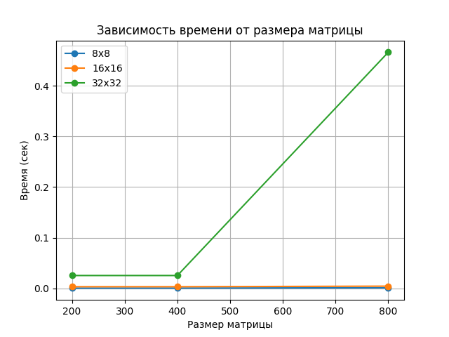

# Отчет по лабораторной работе №4

## Зиминой Евгении (гр. 6214-100503D)

---

### Цель работы

Модифицировать программу умножения матриц для параллельного выполнения с использованием технологии CUDA, а также провести серию экспериментов с различными размерами матриц и конфигурациями блоков для оценки производительности.

---

### Исходные данные

Файлы:
- A_matrix.txt — матрица A  
- B_matrix.txt — матрица B  

Матрицы генерируются случайным образом в программе.

---

### Выходные данные

- Result.txt — результат перемножения матриц  
- время выполнения программы   

---

### Исходный код решения

```py
import numpy as np
from numba import cuda
import time

# CUDA kernel
@cuda.jit
def matmul(A, B, C, N):
    row, col = cuda.grid(2)
    if row < N and col < N:
        tmp = 0
        for k in range(N):
            tmp += A[row, k] * B[k, col]
        C[row, col] = tmp


def run_experiment(N, threads_per_block):
    A = np.random.rand(N, N).astype(np.float32)
    B = np.random.rand(N, N).astype(np.float32)
    C = np.zeros((N, N), dtype=np.float32)

    # перенос на GPU
    d_A = cuda.to_device(A)
    d_B = cuda.to_device(B)
    d_C = cuda.to_device(C)

    threads = (threads_per_block, threads_per_block)
    blocks = (N // threads_per_block + 1, N // threads_per_block + 1)

    start = time.time()

    matmul[blocks, threads](d_A, d_B, d_C, N)
    cuda.synchronize()

    end = time.time()

    return end - start

sizes = [200, 400, 800]
configs = [8, 16, 32]

run_experiment(200,8)

for N in sizes:
    print(f"\n======= Matrix size: {N} =======")
    for t in configs:
        ttime = run_experiment(N, t)
        print(f"Threads per block: {t}x{t} |Time: {ttime:.4f} sec")
```
---

## Особенности выполнения

Выполнение программы производилось в среде Google Colab с использованием GPU (NVIDIA Tesla T4).

Следует отметить, что при первом запуске CUDA происходит инициализация и JIT-компиляция, что может влиять на время выполнения. Поэтому первый запуск не учитывался при проведении измерений.

Также стоит учитывать, что для небольших размеров матриц разница между конфигурациями блоков может быть незначительной.  

---

## Результаты экспериментов
| N (размер) | Потоки | Время (сек) | Объём задачи (N³) |
|------------|--------|-------------|-------------------|
| 200        | 1      |0,0386625    |8000000            |
| 200        | 2      |0,0224523    |8000000            |
| 200        | 4      |0,0106422    |8000000            |
| 400        | 1      |0,263249     |64000000           |
| 400        | 2      |0,179851     |64000000           |
| 400        | 4      |0,113903     |64000000           |
| 800        | 1      |2,69364      |512000000          |
| 800        | 2      |1,50575      |512000000          |
| 800        | 4      |1,14433      |512000000          |


## Анализ результатов
В ходе выполнения лабораторной работы были проведены эксперименты с различными размерами матриц (200, 400, 800) и конфигурациями блоков CUDA (8x8, 16x16, 32x32).

Результаты показали, что с увеличением размера матрицы время выполнения программы возрастает, что связано с увеличением объёма вычислений.

При сравнении различных конфигураций блоков было установлено, что конфигурации 8x8 и 16x16 показывают наиболее стабильные и близкие по значению результаты.

Конфигурация 32x32 в большинстве случаев показала худшую производительность, особенно при увеличении размера матрицы. Это связано с тем, что при большом количестве потоков в блоке ресурсы GPU используются менее эффективно для данной задачи.

Таким образом, выбор конфигурации блоков оказывает влияние на производительность программы.

## График зависимости времени от количества потоков



## Вывод
В ходе лабораторной работы была реализована программа умножения матриц с использованием технологии CUDA.

Были проведены эксперименты с различными размерами матриц и конфигурациями блоков. Результаты показали, что использование GPU позволяет эффективно выполнять параллельные вычисления.

Также было установлено, что конфигурации блоков 8x8 и 16x16 являются наиболее оптимальными для данной задачи, в то время как 32x32 может приводить к ухудшению производительности.

Таким образом, правильный выбор параметров CUDA играет важную роль в оптимизации вычислений.